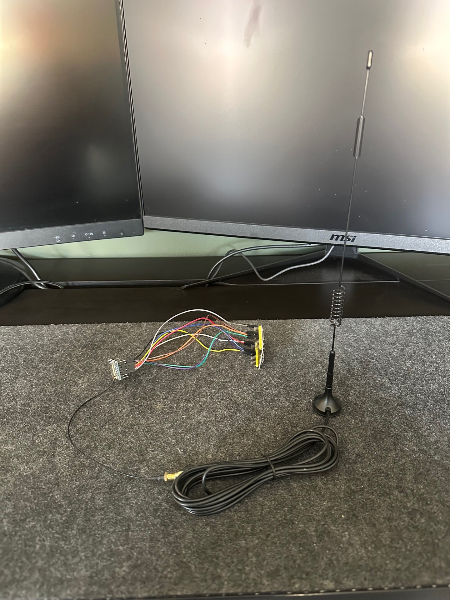
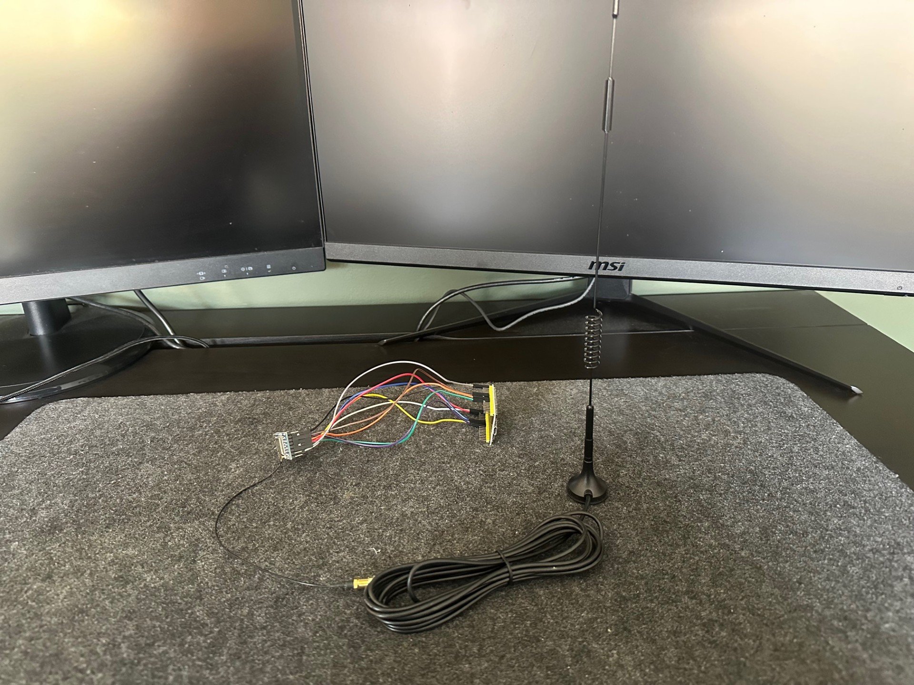

# BRIDGE-NODE

## 📖 Overview  
This node is part of the **Hager Smart Home** system and acts as a bridge between the **mailbox node** and the **web server backend**.

Since my Wi-Fi doesn’t reach the mailbox, I’m using **LoRa** for long-range communication between the mailbox and this bridge node. The bridge receives messages via LoRa and relays them to the backend over Wi-Fi.

---

## ⚙️ Functionality  
This node is responsible for receiving messages via LoRa and logging device activity through HTTP requests. Here's a breakdown of its core functionality:

### 1. Wi-Fi Initialization  
- The device connects to a local Wi-Fi network to enable communication with backend API endpoints.

### 2. Device Registration (One-Time Setup)  
- On the first boot, the device checks its Non-Volatile Storage (NVS) to see if it has already been registered.  
- If not, it sends a `POST` request to a registration endpoint and updates the NVS flag so registration doesn’t happen again on future boots.

### 3. SX127x (RA-02 LoRa) Initialization  
The LoRa module is initialized with SPI communication and configured with the following settings:

- Frequency: **433.72 MHz**  
- Bandwidth: **125 kHz**  
- Spreading Factor: **SF9**  
- Sync Word: **0x12**  
- LNA Gain and Boost: **Enabled**  
- Preamble Length: **8 symbols**

The module is set to **continuous receive mode**, with interrupts and callbacks configured for handling incoming packets and **CAD** (Channel Activity Detection).

### 4. Handling Incoming LoRa Messages  
When a message is received, the `lora_rx_callbacks` function is triggered. It:

- Converts the raw message bytes to a hexadecimal string for debug logging  
- Logs **RSSI**, **SNR**, and **frequency error** for diagnostics  
- Verifies the message content — if it exactly matches `"Hello"`, it sends a `POST` request to the logging endpoint to register the event

---

## 🔩 Hardware Used  
- **ESP32 NodeMCU Dev Kit C**  
- **SX1278 433 MHz Ra-02 LoRa module**  
- **IPEX to SMA adapter cable**  
- **433 MHz SMA antenna (10 dBi)**

---

## 🌐 API Endpoints  
- `POST /api/new-device` – Register a new device  
- `POST /api/new-log` – Log each valid LoRa message

---

## 🛠️ Future Plans  
- Implement **FOTA (Firmware Over-The-Air)** to remotely update the MCU software  
- Add **encryption/decryption** for LoRa messages  
- Introduce **Wi-Fi provisioning** to mimic a commercial setup for easier user configuration

---

## Photos

---

## 🙏 Thank You!

---

### 📬 Contact  
- **Email**: [johannbonde@hotmail.com](mailto:johannbonde@hotmail.com)  
- **LinkedIn**: [Johann Hager](https://www.linkedin.com/in/johann-bonde-hager-9424b531b/)

